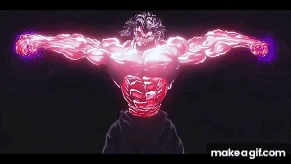

<div align="center">
  <h1>Hi, I'm Paul</h1>
  <p>Final-year Computer Science Engineering Student | Cybersecurity & Red Teaming</p>

  <!-- Ton GIF Baki -->
  
</div>

<br/>

### About Me

```javascript
const paul = {
  status: "Final-year Computer Science Engineering Student",
  specialization: "Offensive Security & Red Teaming",
  coreSkills: [
    "Red Teaming",
    "Penetration Testing",
    "Reverse Engineering",
    "OSINT",
    "Active Directory Security"
  ],
  languages: ["Python", "C", "Bash", "PowerShell"],
  focus: "Internal network exploitation, CTFs & custom tooling"
};
